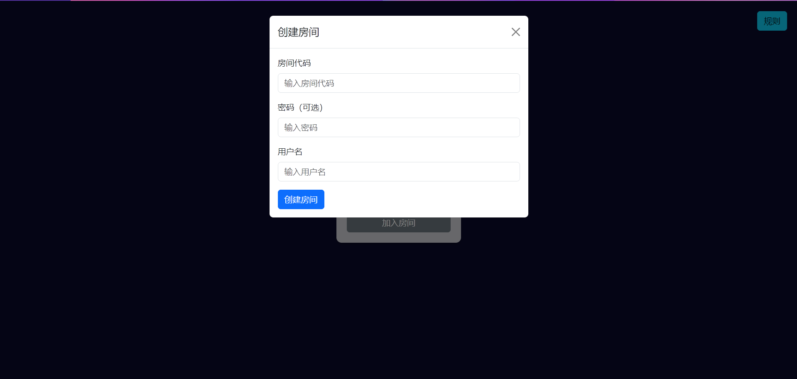

# Werewolf 狼人杀

一款在线狼人杀游戏，支持创建房间，不支持同时加入两个房间。

大致在 2024 年 10 月开发，经历过一些测试，可能存在一些前端的 bug，不过一般不影响游戏性。

游戏规则位于 `/static/rules.txt`，也可在网页主页右上角查看。

由于本人也不常玩桌游，所以规则可能比较简单（有些规则太复杂就不想实现了（）），而且默认是屠城，屠边可以自行修改代码 ~~（其实是当时不想写了）~~

**注意：使用 AI 非常消耗 token！**

默认把 AI 功能关闭了,想要打开可以注释 `app.py` 的 186 行。

## 后记

这个项目可以算是与 AI 协同开发的一次尝试，前端代码几乎都是 AI 写的，我只需要当甲方提要求就好了，不过 `room.js` 涉及到具体逻辑与交互 AI 表现不太好，我自己个性化改了很多（其实就是最开始没有规划也没有文档，导致前端交互变成答辩了，属于是想到哪里写到哪了）

不足之处：可能代码还是比较混乱，而且房间中使用了 websocket，依靠 ws 连接判断玩家是否下线，不支持断线重连，而且更加奇妙的是我写到后面更新的内容太多了，所以就又加上了定时 GET 状态，非常抽象。而且是手写 ws，按理来讲可以使用其它库来实现的。

AI 的交互库依旧是照搬 [shunshunshubot](https://github.com/Huasushis/shunshunshubot)，当时最开始使用的是模拟网页端，后面又尝试使用官方 api 接口，所以混在一起形成了依托答辩。默认是使用 api，需要使用网页端逆向的请取消 `revqw.py` 中的注释并注释掉相应的 api 内容，并把网页版的 cookie 放入 `cookies.txt` 中。

此外这个 AI 使用 asyncio 协程来实现，总感觉我脑子抽了一样，都是 go 害的。

> font-awesome 的链接好像挂了，待修